# System Architecture

This document provides a comprehensive overview of the VisionsAlign system architecture, design decisions, and technical implementation.

## 🏗️ **High-Level Architecture**

```mermaid
graph TB
    User[👤 User] --> NextJS[🌐 Next.js App]
    NextJS --> Auth[🔐 NextAuth.js]
    NextJS --> DB[(🗄️ PostgreSQL)]
    NextJS --> Stripe[💳 Stripe API]
    NextJS --> Resend[📧 Resend API]
    NextJS --> N8N[🤖 n8n Webhook]
    
    N8N --> AI[🧠 AI Processing]
    AI --> Playbook[📋 Generated Playbook]
    Playbook --> DB
    
    Netlify[☁️ Netlify] --> NextJS
    
    subgraph "External Services"
        Stripe
        Resend
        N8N
        Google[🔍 Google OAuth]
    end
```



## 🎯 **Core Components**

### **Frontend Layer**
- **Framework**: Next.js 14 with App Router
- **Styling**: Tailwind CSS + DaisyUI
- **Components**: Atomic Design System
- **State Management**: React Server Components + Client Components
- **Authentication**: NextAuth.js sessions

### **Backend Layer**
- **API Routes**: Next.js API routes with middleware
- **Database**: PostgreSQL with Prisma ORM
- **Authentication**: JWT sessions via NextAuth.js
- **Payment Processing**: Stripe integration
- **Email Service**: Resend for transactional emails

### **AI Integration**
- **Webhook System**: n8n for AI orchestration
- **Processing Pipeline**: 6-7 AI expert personas
- **Async Processing**: Background job processing
- **Status Tracking**: Real-time playbook status updates

## 📊 **Data Flow Architecture**

### **User Journey Flow**


### **Payment Flow**


## 🗄️ **Database Schema**

### **Core Entities**

#### **User**
```prisma
model User {
  id                String    @id @default(cuid())
  email             String    @unique
  name              String?
  image             String?
  linkedinUrl       String?   @map("linkedin_url")
  
  // Subscription & Access
  hasAccess         Boolean   @default(false)
  planTier          PlanTier  @default(STARTER)
  playbookCredits   Int       @default(1)
  
  // Stripe Integration
  stripeCustomerId  String?   @unique @map("stripe_customer_id")
  stripePriceId     String?   @map("stripe_price_id")
  
  // Relationships
  accounts          Account[]
  sessions          Session[]
  playbooks         Playbook[]
  
  createdAt         DateTime  @default(now()) @map("created_at")
  updatedAt         DateTime  @updatedAt @map("updated_at")
  
  @@map("users")
}
```

#### **Playbook**
```prisma
model Playbook {
  id                    String        @id @default(cuid())
  userId                String        @map("user_id")
  
  // Stakeholder Information
  stakeholderName       String        @map("stakeholder_name")
  stakeholderLinkedIn   String        @map("stakeholder_linkedin")
  
  // Meeting Context
  meetingContext        String        @map("meeting_context")
  meetingObjective      String        @map("meeting_objective")
  additionalContext     String?       @map("additional_context")
  
  // Processing Status
  status                PlaybookStatus @default(PENDING)
  content               String?
  
  // Metadata
  playbookType          PlaybookType   @default(STAKEHOLDER) @map("playbook_type")
  
  // Relationships
  user                  User          @relation(fields: [userId], references: [id], onDelete: Cascade)
  
  createdAt             DateTime      @default(now()) @map("created_at")
  updatedAt             DateTime      @updatedAt @map("updated_at")
  
  @@map("playbooks")
}
```

### **Enums**
```prisma
enum PlanTier {
  STARTER
  PRO
  DIRECTOR
}

enum PlaybookStatus {
  PENDING
  PROCESSING
  COMPLETED
  FAILED
}

enum PlaybookType {
  STAKEHOLDER  // Pro tier - 6 AI personas
  RELATIONSHIP // Director tier - 7 AI personas including The Connector
}
```

## 🔐 **Security Architecture**

### **Authentication & Authorization**
- **Session Management**: NextAuth.js with JWT tokens
- **OAuth Integration**: Google OAuth 2.0
- **Admin Access**: Email-based admin verification
- **API Protection**: Middleware-based route protection

### **Data Security**
- **Environment Variables**: Zod validation with startup checks
- **Secrets Management**: Netlify environment variables
- **Database Security**: Prisma with parameterized queries
- **HTTPS Enforcement**: All communications encrypted

### **Rate Limiting**
- **API Endpoints**: Per-user and per-IP rate limiting
- **Playbook Generation**: 10 requests per hour per user
- **Authentication**: Brute force protection

## 🚀 **Deployment Architecture**

### **Netlify Deployment**

```mermaid
graph LR
    Git[📁 Git Repository] --> Netlify[☁️ Netlify]
    Netlify --> Build[🔨 Build Process]
    Build --> Deploy[🚀 Deployment]
    Deploy --> CDN[🌐 Global CDN]
    
    subgraph "Build Process"
        Install[📦 npm install]
        TypeCheck[✅ Type Check]
        Build2[🏗️ Next.js Build]
        Secrets[🔍 Secrets Scan]
    end
```


### **Environment Configuration**
- **Development**: Local PostgreSQL + development APIs
- **Production**: Managed PostgreSQL + production APIs
- **Secrets Scanning**: Netlify security validation
- **Environment Variables**: Centralized configuration system

## 🔄 **Integration Architecture**

### **External Service Integration**

#### **Stripe Payment Processing**
- **Checkout Sessions**: Hosted payment pages
- **Webhook Events**: Real-time payment status updates
- **Customer Portal**: Self-service billing management
- **Subscription Management**: Tier-based access control

#### **n8n AI Orchestration**
- **Webhook Triggers**: Async playbook generation
- **Data Payload**: Comprehensive user and stakeholder data
- **Processing Pipeline**: Multi-persona AI analysis
- **Status Updates**: Real-time completion notifications

#### **Resend Email Service**
- **Transactional Emails**: User notifications
- **Template System**: Branded email templates
- **Delivery Tracking**: Email status monitoring
- **Beta Access**: Lead collection and nurturing

## 🎨 **Frontend Architecture**

### **Atomic Design System**
```
components/
├── atoms/           # Basic UI elements
│   ├── Button/      # Reusable button component
│   ├── Input/       # Form input elements
│   └── Modal/       # Modal dialogs
├── molecules/       # Component combinations
│   ├── Card/        # Content cards
│   ├── Navigation/  # Navigation elements
│   └── Form/        # Form compositions
├── organisms/       # Complex sections
│   ├── Header/      # Site header
│   ├── Footer/      # Site footer
│   └── Features/    # Feature sections
└── utils/           # Utilities
    ├── design-tokens.ts
    ├── animations.ts
    └── providers.tsx
```

### **State Management Strategy**
- **Server Components**: Default for data fetching
- **Client Components**: Interactive UI elements
- **Session State**: NextAuth.js session management
- **Form State**: React Hook Form for complex forms
- **Global State**: Minimal use, prefer server state

## 📈 **Performance Architecture**

### **Optimization Strategies**
- **Static Generation**: Pre-built pages where possible
- **Server Components**: Reduced client-side JavaScript
- **Image Optimization**: Next.js automatic optimization
- **Code Splitting**: Automatic route-based splitting
- **CDN Distribution**: Netlify global edge network

### **Caching Strategy**
- **Database Queries**: Prisma query optimization
- **API Responses**: Appropriate cache headers
- **Static Assets**: Long-term browser caching
- **Session Data**: Efficient session storage

## 🔧 **Development Architecture**

### **Code Organization**
- **Feature-based Structure**: Logical grouping by functionality
- **Centralized Configuration**: Single source of truth for settings
- **Utility Libraries**: Reusable business logic
- **Type Safety**: Full TypeScript implementation

### **Development Workflow**

```mermaid
graph LR
    Dev[👨‍💻 Developer] --> Code[📝 Code Changes]
    Code --> Lint[🔍 ESLint Check]
    Lint --> Type[✅ TypeScript Check]
    Type --> Build[🏗️ Build Test]
    Build --> Deploy[🚀 Deploy]
    
    Deploy --> Review[👀 Code Review]
    Review --> Merge[🔄 Merge to Main]
    Merge --> Production[🌐 Production Deploy]
```


## 📊 **Monitoring & Observability**

### **Application Monitoring**
- **Error Tracking**: Comprehensive error logging
- **Performance Metrics**: Response time monitoring
- **User Analytics**: Usage pattern analysis
- **Health Checks**: System status monitoring

### **Business Metrics**
- **User Engagement**: Dashboard usage patterns
- **Conversion Rates**: Free to paid conversions
- **Playbook Generation**: Success/failure rates
- **Revenue Tracking**: Subscription metrics

## 🔮 **Scalability Considerations**

### **Current Architecture Limits**
- **Database**: Single PostgreSQL instance
- **Processing**: Synchronous webhook processing
- **Storage**: Database-based content storage
- **Geographic**: Single deployment region

### **Future Scaling Strategies**
- **Database Scaling**: Read replicas and connection pooling
- **Processing**: Queue-based async job processing
- **Storage**: CDN-based content delivery
- **Geographic**: Multi-region deployment

## 🛠️ **Technology Decisions**

### **Framework Choice: Next.js 14**
- **Reasoning**: Full-stack React framework with excellent DX
- **Benefits**: Server components, API routes, built-in optimization
- **Trade-offs**: Vendor lock-in, learning curve for team

### **Database Choice: PostgreSQL + Prisma**
- **Reasoning**: Relational data with strong consistency requirements
- **Benefits**: ACID compliance, rich query capabilities, type safety
- **Trade-offs**: Scaling complexity, single point of failure

### **Deployment Choice: Netlify**
- **Reasoning**: Excellent Next.js support with built-in security
- **Benefits**: Zero-config deployment, secrets scanning, global CDN
- **Trade-offs**: Vendor lock-in, limited backend capabilities

## 📚 **Related Documentation**

- [`DEVELOPER_ONBOARDING.md`](./DEVELOPER_ONBOARDING.md) - Getting started guide
- [`API_REFERENCE.md`](./API_REFERENCE.md) - Complete API documentation
- [`CONFIG_USAGE.md`](./CONFIG_USAGE.md) - Configuration system guide
- [`ENVIRONMENT.md`](./ENVIRONMENT.md) - Environment setup guide

## 🔄 **Architecture Evolution**

This architecture document is living documentation that evolves with the system. Major architectural changes should be documented here with:

- **Decision Date**: When the change was made
- **Reasoning**: Why the change was necessary
- **Impact**: What systems were affected
- **Migration**: How the transition was handled

Last Updated: January 2024
